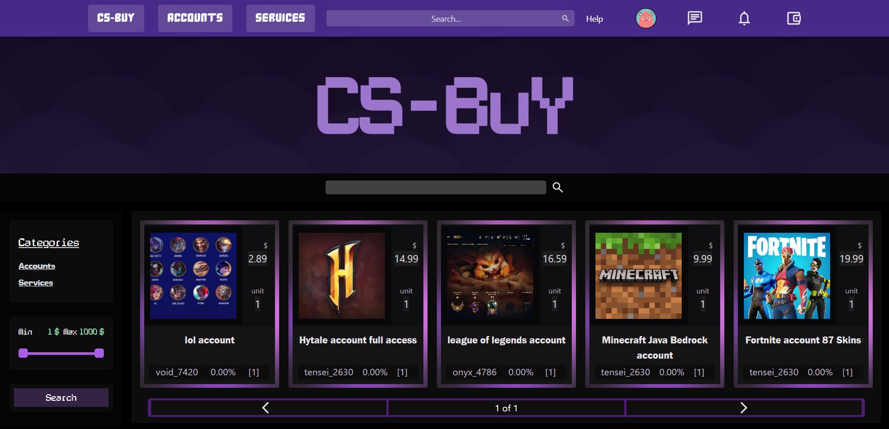

<h2 align="left">
  CS-Buy Page
  <sub>
    
  </sub>
</h2>

## Still in development



<h2 align="center">Technologies</h2>
<p>
  React
  

  Node.js
  

  Next.js
  
</p>

<h2 align="center">Frameworks</h2>
- Tailwind, Fastify, Socket.io, Jwt, Mysql12, Crypto, Typescript, Jest, Cloudinary, Stripe, Paypal

<h2 align="center">Installation and Execution </h2>
<ul>
  <li><code>npm run install</code></li>
  <li><code>npm run build</code></li>
  <li><code>npm run api</code></li>
  <li>Server will listen on <code>127.0.0.7:4038</code></li>
</ul>

<h1 align="center">Architecture</h1>

```text
Backend
├── api/                         # Root backend directory
│   ├── modules/                 # Tools used by the application
│   │   ├── images.js            # NSFW image filtering using Cloudinary API
│   │   ├── index.js             # Entry point where modules are loaded
│   │   └── logger.js            # Logging with Winston
│   │
│   ├── routes/
│   │   ├── controllers/         # Intuitive controllers consumed by routes
│   │   ├── auth.routes.ts       # Authentication, sessions and profile
│   │   ├── chat.routes.ts       # Chat, sessions and notifications
│   │   ├── order.routes.ts      # Orders, cancellations and order history
│   │   ├── purchase.routes.ts   # Checkout and payments
│   │   ├── seller.routes.ts     # Product management by seller 
│   │   ├── user.routes.ts       # Login, registration and alert notifications
│   │   └── wallet.routes.ts     # Transactions, withdrawals and similar ones
│   │
│   ├── scripts/
│   │   ├── cleanup.ts           # Clean checkout every few seconds
│   │   └── db.ts                # Module for initializing mysql12, return db and pool
│   ├── config/
│   │   ├── bcrypt.ts
│   │   ├── env.ts
│   │   ├── error.env.ts
│   │   ├── filter.ts
│   │   └── server.config.ts
│   ├── middleware/
│   ├── tests/
│   ├── types/
│   ├── api.js
│   └── robots.txt
│
└── metadata/
```

<h2 align="center">Testing</h2>
- I implemented **Jest** for testing

<h2>Concept about the app</h2>
- The Cs-buy marketplace is c2c, i structured the project to be used for consumers and by consumers, i implemented real-time chat with socket.io for communication with the seller, when a consumer buyer buys something, the seller needs to wait for 5 days or wait for confirmation by the buyer, we implemented an escrow lite to prevent scams, where money gonna wait in stripe all the time and later gonna be sent to seller wallet, app was created as a fast and optimized page, thats why i implemented lazy load with next.js for not reload content when we go to other section, i gonna implement redis later for cache optimization in memory

## About me

* i’ve been working on the project 1 year and 5 months approx, it started as a concept and along the way i researched to choose the best stack possible and studied them.
* Feel free with asking me something, i love speaking and help ^^. I’m passionate about programming. To me, it’s more than just code; it’s an art.
* mi telegram⁠
* mi discord: kanashii18⁠
